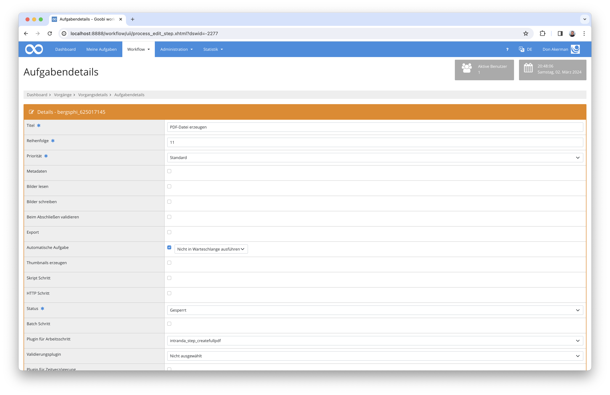

## Einführung
Die vorliegende Dokumentation beschreibt die Installation, Konfiguration und den Einsatz dieses Plugins zum Generieren der PDF Dateien aus Bildern.


## Installation
Zur Nutzung des Plugins muss es an folgenden Ort kopiert werden:

```bash
/opt/digiverso/goobi/plugins/step/plugin_intranda_step_createfullpdf-base.jar
```

Die Konfiguration des Plugins wird unter folgendem Pfad erwartet:

```bash
/opt/digiverso/goobi/config/plugin_intranda_step_createfullpdf.xml
```


## Überblick und Funktionsweise
Nachdem das Plugin korrekt installiert wurde, kann es in der Nutzeroberfläche für die Verwendung innerhalb des Workflows bei dem gewünschten Arbeitsschritt konfiguriert werden. Hierfür muss als Plugin der Wert `intranda_step_createfullpdf` ausgewählt und die Ausfühlung sollte als automatisch festgelegt werden.




## Konfiguration
Die Konfiguration des Plugins erfolgt in der Datei `plugin_intranda_step_createfullpdf.xml` wie hier aufgezeigt:

{{CONFIG_CONTENT}}

{{CONFIG_DESCRIPTION_PROJECT_STEP}}

| Wert | Beschreibung |
| :--- | :--- |
| `imageFolder` | Dieser Parameter erwartet den Namen des Bildordners. Mögliche Werte sind `media` und `master`. Alle anderen Angaben werden als `media` interpretiert. |
| `singlePagePdf` | Das Attribut `enabled` dieses Parameters bestimmt, ob Einzelseiten-PDFs erzeugt werden sollen. |
| `fullPdf` | Das Attribut `enabled` dieses Parameters bestimmt, ob ein Gesamt-PDF erzeugt werden soll. Das Attribut `mode` steuert dabei, wie dieses PDF erzeugt werden soll. Hierfür steht der Wert `mets` zur Verfügung, um das PDF basierend auf der METS-Datei zu erzeugen. Alternativ kann als Wert `singlepages` verwendet werden, um das Gesamt-PDF aus den zuvor erzeugten Einzelseiten-PDFs zu generieren. Die Einzelseiten-PDFs werden dabei nur dann temporär erzeugt, wenn sie innerhalb der Konfiguration nicht bereits aktiviert wurden. Das Attribut `pdfConfigVariant` hingegen ist optional und legt fest, welche Konfigurationsvariante verwendet werden soll. Ist sie nicht gesetzt, wird `default` verwendet. |
| `exportPath` | Dieser optionale Parameter kann verwendet werden, um einen Pfad für den Export der PDF-Dateien festzulegen. Wenn er verwendet wird, wird ein absoluter Pfad erwartet. Ist er nicht angegeben, werden die PDF-Dateien innerhalb des `ocr`-Verzeichnisses des Vorgangs erzeugt. |
