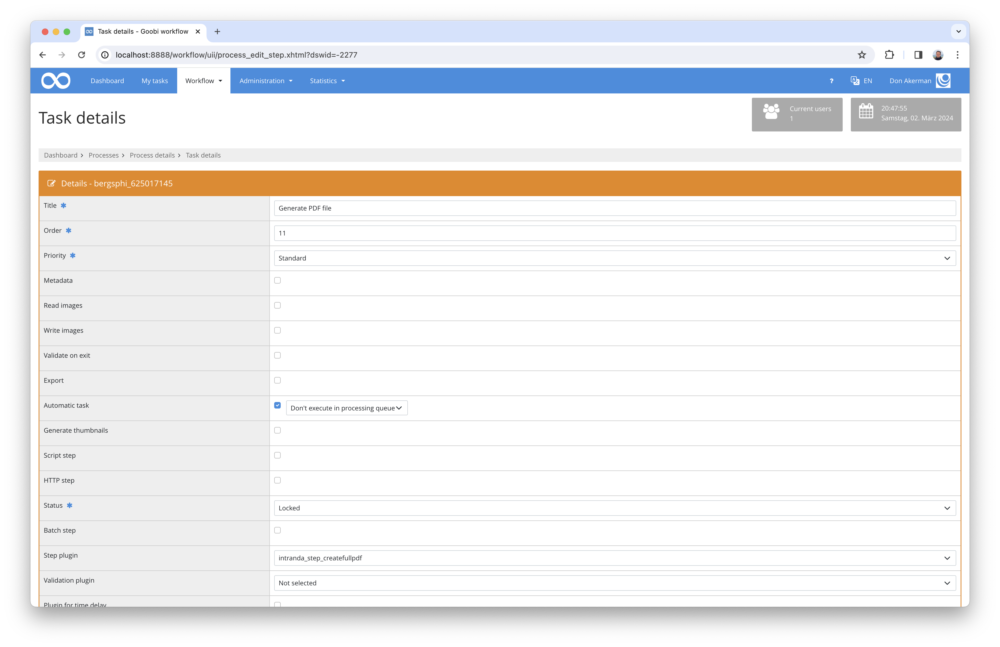

## Introduction
This documentation describes how to install and configure this plugin to create PDF files out of images.


## Installation 
To use the plugin, it must be copied to the following location:

```bash
/opt/digiverso/goobi/plugins/step/plugin_intranda_step_createfullpdf-base.jar
```

The configuration of the plugin is expected under the following path:

```bash
/opt/digiverso/goobi/config/plugin_intranda_step_createfullpdf.xml
```

## Overview and functionality
Once the plugin has been installed correctly, it can be configured in the user interface for use within the workflow for the desired work step. To do this, the value `intranda_step_createfullpdf` must be selected as the plugin and the filling should be set as automatic.




## Configuration
The plugin is configured in the file `plugin_intranda_step_zbz_order_delivery.xml` as shown here:

{{CONFIG_CONTENT}}

{{CONFIG_DESCRIPTION_PROJECT_STEP}}

| Value | Description |
| :--- | :--- |
| `imageFolder` | This parameter expects the name of the image folder. Possible values are `media` and `master`, anything else will be regarded as `media`. |
| `singlePagePdf` | The `enabled` attribute of this parameter determines whether single-page PDFs are to be generated. |
| `fullPdf` | The `enabled` attribute of this parameter determines whether a complete PDF is to be generated. The `mode` attribute controls how this PDF is to be generated. The value ‘mets’ is available for this in order to generate the PDF based on the METS file. Alternatively, the value ‘singlepages’ can be used to generate the overall PDF from the previously created single-page PDFs. The single-page PDFs are only generated temporarily if they have not already been activated within the configuration. The `pdfConfigVariant` attribute, on the other hand, is optional and determines which configuration variant is to be used. If it is not set, `default` is used. |
| `exportPath` | This optional parameter can be used to specify a path for exporting the PDF files. If it is used, an absolute path is expected. If it is not specified, the PDF files are created within the `ocr` directory of the process. |